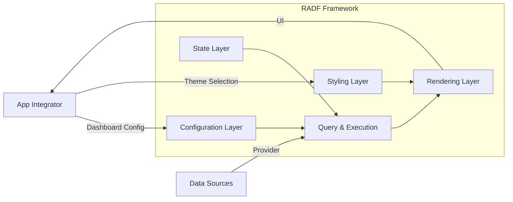
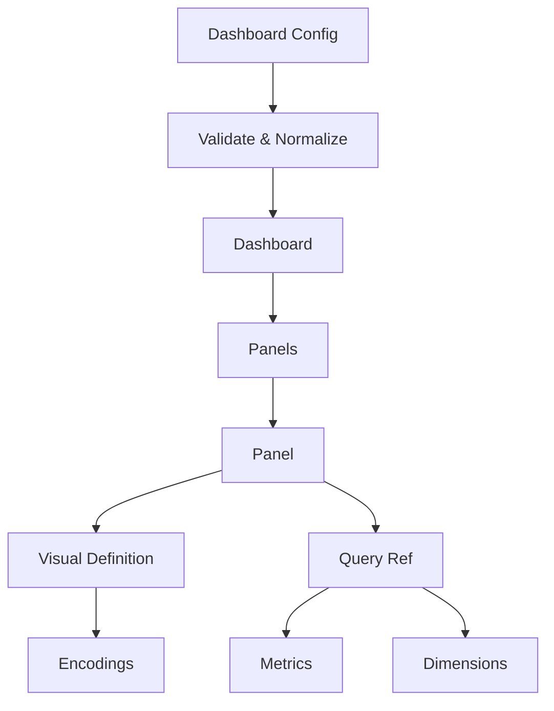
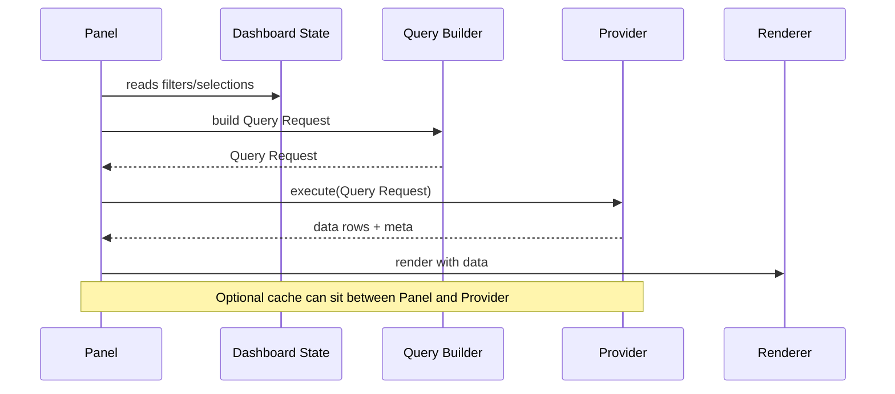
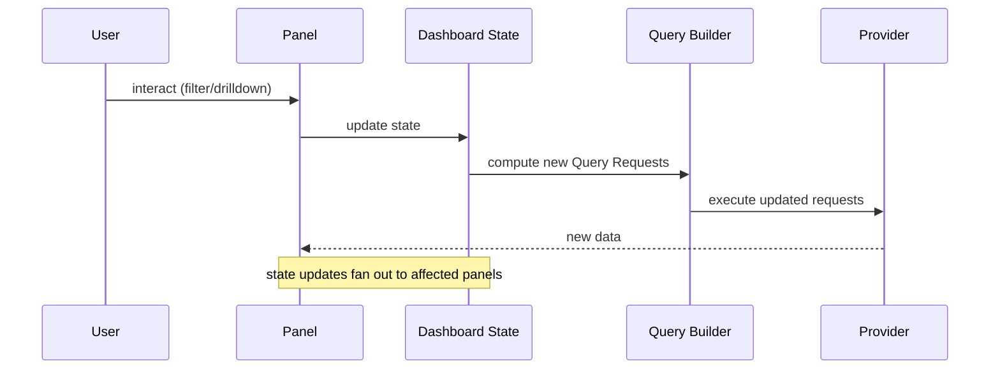
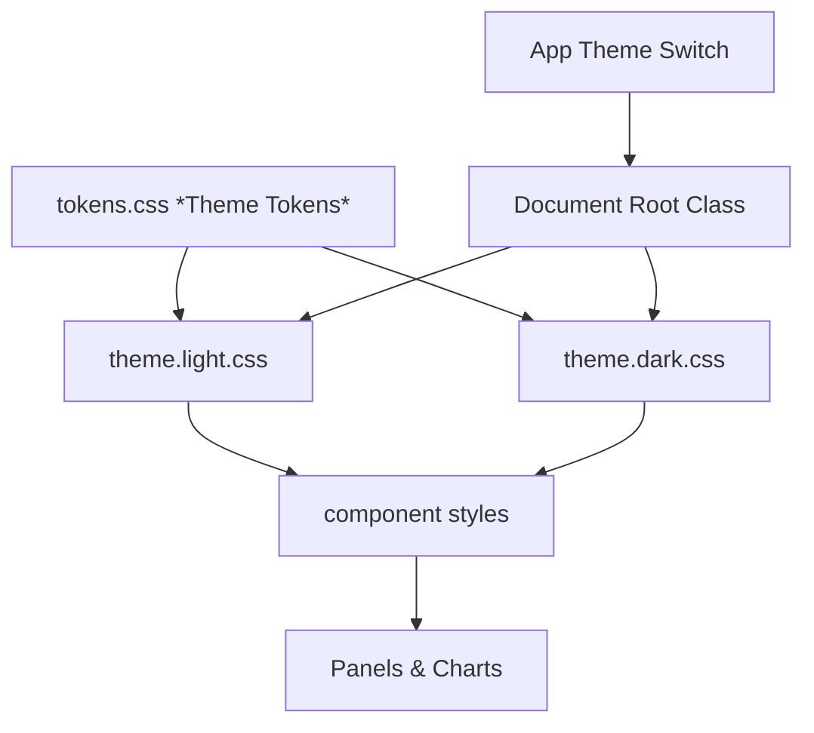
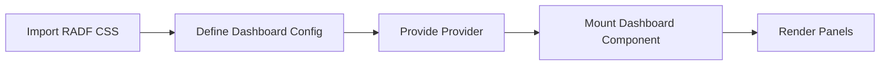
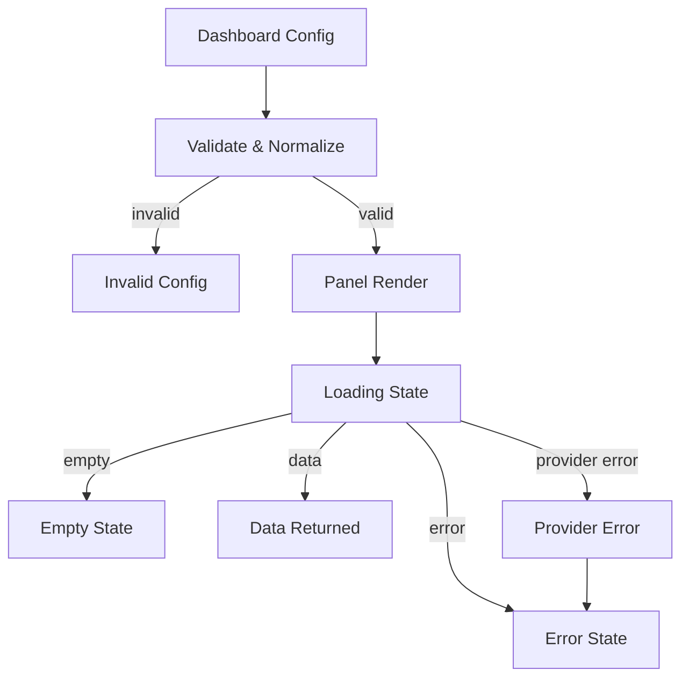
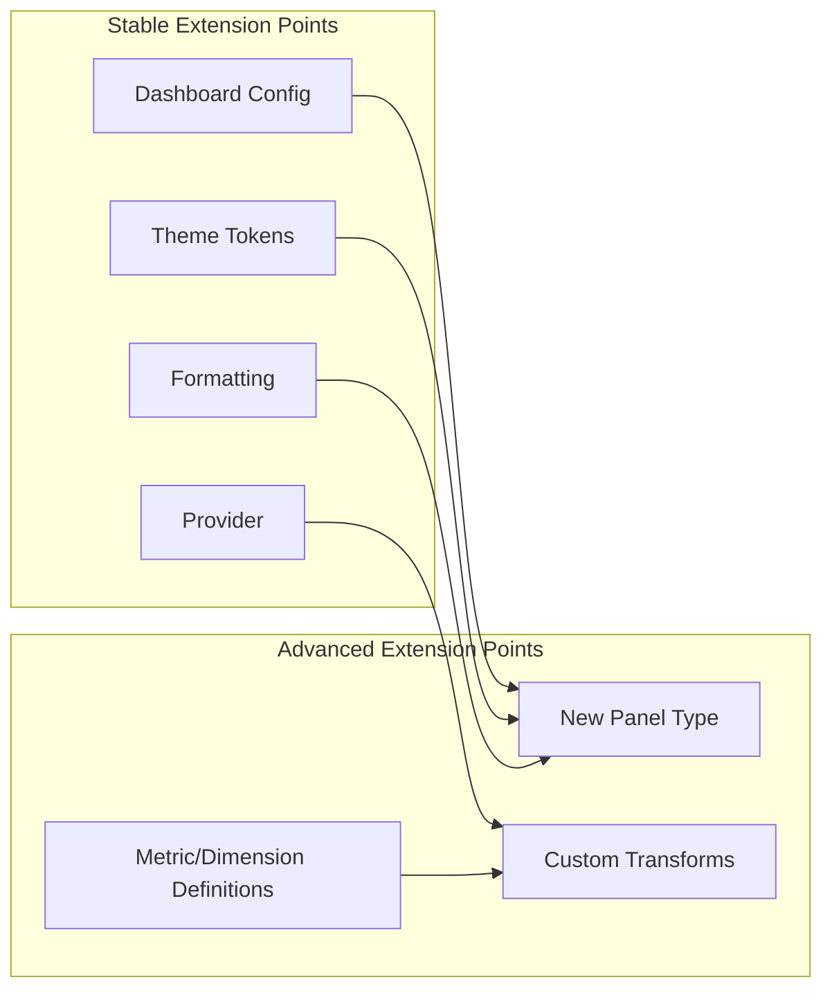

# RADF Visual Overview

## Intro
- This document summarizes RADF at a conceptual level using diagrams to show major layers and flows.
- The diagrams use consistent terms (see glossary) and keep implementation details abstract.
- Each diagram focuses on one concern: system context, config composition, data flow, state propagation, styling, integration, and error handling.
- The flows reflect a config-driven, Recharts-based dashboard system with provider-backed data.

## Glossary (consistent terms)
- **Dashboard Config**: Declarative definition of a dashboard (title, panels, queries, layout).
- **Panel**: A single visual block (chart, table, card) driven by a query and encodings.
- **Query Request**: A normalized request produced from config + dashboard state.
- **Provider**: Data adapter that executes Query Requests against a data source.
- **Dashboard State**: Runtime state (filters, selections, drilldowns, date range).
- **Theme Tokens**: CSS variables that define colors, spacing, and typography.
- **Rendering Layer**: Components that turn panel data into visuals.

---

## Diagram 1 — RADF at a glance (system context)

**Interpretation**
- The app supplies config and theme choices; RADF supplies runtime logic and rendering.
- Providers connect RADF to external data sources.
- Styling flows through CSS tokens into the rendering layer.

---

## Diagram 2 — Config → Runtime object model

**Interpretation**
- Config is validated/normalized before it becomes runtime objects.
- Panels reference visuals and queries; queries reference metrics/dimensions.
- The model stays declarative and composable.

---

## Diagram 3 — Data request lifecycle

**Interpretation**
- Panels build Query Requests from config and dashboard state.
- Providers return shaped data for rendering.
- A cache layer may be inserted without changing panel logic.

---

## Diagram 4 — State + interactions propagation

**Interpretation**
- Interactions mutate dashboard state, not panels directly.
- Updated state triggers new query requests.
- Affected panels re-render as new data arrives.

---

## Diagram 5 — Theming & styling pipeline

**Interpretation**
- Tokens are shared across all themes.
- The app toggles a root theme class to select a theme.
- Component styles read CSS variables to affect panel chrome and charts.

---

## Diagram 6 — Minimal “happy path” integration

**Interpretation**
- The minimal path needs CSS, a config, a provider, and a dashboard mount.
- Panel rendering follows automatically from the config.

---

## Diagram 7 — Error handling & validation flow

**Interpretation**
- Config validation prevents broken runtime states.
- Panels should surface loading, empty, and error states distinctly.
- Provider errors should be visible at panel or dashboard level.

---

## Diagram 8 — Extensibility points map (optional)

**Interpretation**
- Stable extensions are safe and expected in most apps.
- Advanced extensions often require deeper knowledge of the framework.

---

## How to read these diagrams
- Boxes are concepts (config, state, provider), not code classes.
- Arrows show data or control flow direction.
- Sequence diagrams show time-ordered interactions.
- “Optional” elements are noted explicitly (e.g., cache).
- Terms match the glossary; if a term is unfamiliar, check the glossary first.

## Common pitfalls
- Skipping validation and letting invalid config reach runtime.
- Mixing panel-specific filters with global dashboard filters.
- Forgetting to re-run queries after state changes.
- Treating provider errors as empty data instead of error states.
- Applying theme classes without importing the CSS entrypoint.
- Overloading single panels with multiple concerns instead of splitting panels.
- Using overly dense diagrams that hide the main idea.
